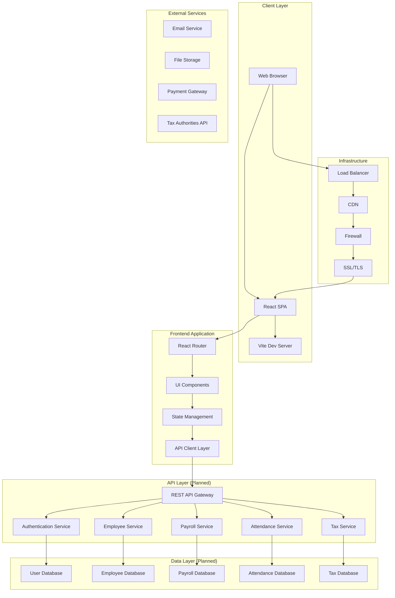
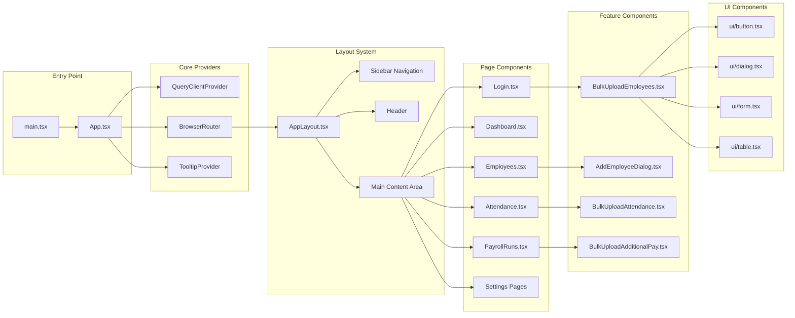
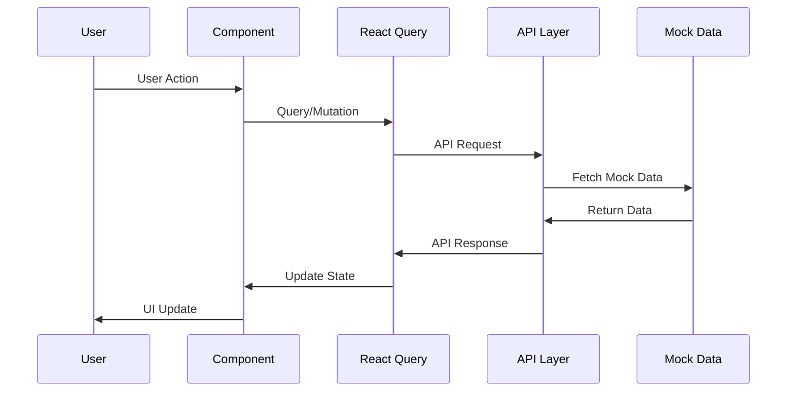
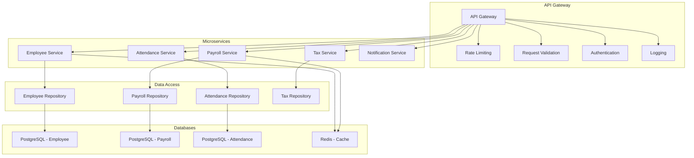
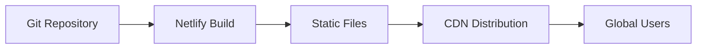
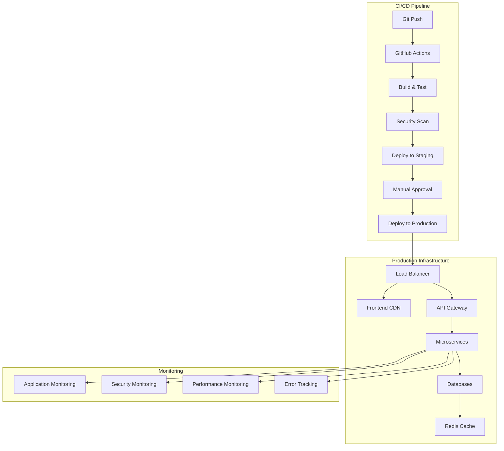

# Payroll Application - Technical Architecture & Security Analysis

## 🏗️ System Architecture Overview



## 📋 Current Application Stack

### Frontend Technologies

- **Framework**: React 18 with TypeScript
- **Build Tool**: Vite 6.2.2
- **Routing**: React Router DOM 6.26.2
- **State Management**: TanStack React Query 5.56.2
- **UI Library**: Radix UI + Custom Components
- **Styling**: TailwindCSS 3.4.11
- **Form Handling**: React Hook Form 7.53.0
- **Validation**: Zod 3.23.8
- **Animations**: Framer Motion 12.6.2

### Development & Deployment

- **Development Server**: Vite dev server (port 8080)
- **Deployment**: Netlify (static hosting)
- **Package Manager**: npm
- **Testing**: Vitest 3.1.4
- **Code Quality**: Prettier, TypeScript

## 🏛️ Application Architecture

### 1. Frontend Architecture



### 2. Data Flow Architecture



### 3. API Architecture (Planned)



## 🔒 Security Analysis & Recommendations

### Current Security Status: ⚠️ CRITICAL GAPS

#### 1. Authentication & Authorization

**Current State**: ❌ No authentication implemented

- Login form exists but doesn't validate credentials
- No session management
- No role-based access control
- No JWT or token-based authentication

**Recommendations**:

```typescript
// Implement JWT-based authentication
interface AuthContext {
  user: User | null;
  login: (credentials: LoginCredentials) => Promise<void>;
  logout: () => void;
  isAuthenticated: boolean;
  userRole: UserRole;
}

// Add route protection
const ProtectedRoute = ({ children, requiredRole }: Props) => {
  const { isAuthenticated, userRole } = useAuth();

  if (!isAuthenticated) {
    return <Navigate to="/login" />;
  }

  if (requiredRole && userRole !== requiredRole) {
    return <Navigate to="/unauthorized" />;
  }

  return children;
};
```

#### 2. Data Protection

**Current State**: ❌ Sensitive data exposed

- Employee PII (PAN, Aadhar, Bank details) in mock data
- No data encryption at rest or in transit
- No data masking in UI

**Recommendations**:

```typescript
// Implement data encryption
const encryptSensitiveData = (data: string): string => {
  return crypto.encrypt(data, ENCRYPTION_KEY);
};

// Add data masking
const maskPAN = (pan: string): string => {
  return pan.replace(/(?<=^.{5}).(?=.{4}$)/g, "*");
};

// Implement field-level security
const SecureField = ({ value, type }: Props) => {
  const { userRole } = useAuth();
  const hasPermission = checkFieldPermission(type, userRole);

  return hasPermission ? value : maskSensitiveData(value);
};
```

#### 3. API Security

**Current State**: ❌ No backend API implemented

- All data is static mock data
- No input validation on server side
- No rate limiting
- No CORS configuration

**Recommendations**:

```typescript
// Implement comprehensive API security
const apiSecurityMiddleware = {
  // Rate limiting
  rateLimit: rateLimit({
    windowMs: 15 * 60 * 1000, // 15 minutes
    max: 100, // limit each IP to 100 requests per windowMs
  }),

  // Input validation
  validateInput: (schema: ZodSchema) => {
    return (req: Request, res: Response, next: NextFunction) => {
      const result = schema.safeParse(req.body);
      if (!result.success) {
        return res.status(400).json({ errors: result.error });
      }
      next();
    };
  },

  // CORS configuration
  cors: cors({
    origin: process.env.ALLOWED_ORIGINS?.split(",") || [],
    credentials: true,
  }),
};
```

#### 4. Frontend Security

**Current State**: ⚠️ Basic security measures

- No XSS protection
- No CSRF protection
- No Content Security Policy
- No secure headers

**Recommendations**:

```html
<!-- Add security headers -->
<meta
  http-equiv="Content-Security-Policy"
  content="default-src 'self'; script-src 'self' 'unsafe-inline'; style-src 'self' 'unsafe-inline';"
/>
<meta http-equiv="X-Content-Type-Options" content="nosniff" />
<meta http-equiv="X-Frame-Options" content="DENY" />
<meta http-equiv="X-XSS-Protection" content="1; mode=block" />
```

```typescript
// Implement XSS protection
const sanitizeInput = (input: string): string => {
  return DOMPurify.sanitize(input);
};

// Add CSRF protection
const csrfToken = document
  .querySelector('meta[name="csrf-token"]')
  ?.getAttribute("content");

fetch("/api/employees", {
  method: "POST",
  headers: {
    "Content-Type": "application/json",
    "X-CSRF-Token": csrfToken,
  },
  body: JSON.stringify(data),
});
```

#### 5. Environment & Configuration Security

**Current State**: ❌ No environment configuration

- No environment variables
- No secrets management
- No configuration validation

**Recommendations**:

```typescript
// Environment configuration
interface Config {
  NODE_ENV: "development" | "production" | "test";
  API_BASE_URL: string;
  JWT_SECRET: string;
  DATABASE_URL: string;
  REDIS_URL: string;
  ALLOWED_ORIGINS: string[];
  ENCRYPTION_KEY: string;
}

const config: Config = {
  NODE_ENV: process.env.NODE_ENV || "development",
  API_BASE_URL: process.env.API_BASE_URL || "http://localhost:3000",
  JWT_SECRET: process.env.JWT_SECRET!,
  DATABASE_URL: process.env.DATABASE_URL!,
  REDIS_URL: process.env.REDIS_URL!,
  ALLOWED_ORIGINS: process.env.ALLOWED_ORIGINS?.split(",") || [],
  ENCRYPTION_KEY: process.env.ENCRYPTION_KEY!,
};

// Validate required environment variables
Object.entries(config).forEach(([key, value]) => {
  if (!value && key !== "ALLOWED_ORIGINS") {
    throw new Error(`Missing required environment variable: ${key}`);
  }
});
```

### Security Implementation Priority

#### Phase 1: Critical Security (Week 1-2)

1. ✅ Implement JWT authentication
2. ✅ Add route protection
3. ✅ Implement input validation
4. ✅ Add HTTPS/SSL
5. ✅ Set up environment variables

#### Phase 2: Data Protection (Week 3-4)

1. ✅ Encrypt sensitive data
2. ✅ Implement data masking
3. ✅ Add field-level permissions
4. ✅ Set up audit logging
5. ✅ Implement data retention policies

#### Phase 3: Advanced Security (Week 5-6)

1. ✅ Add rate limiting
2. ✅ Implement 2FA
3. ✅ Set up monitoring & alerting
4. ✅ Add security headers
5. ✅ Implement backup & recovery

#### Phase 4: Compliance & Testing (Week 7-8)

1. ✅ Security testing (penetration testing)
2. ✅ Compliance audit (GDPR, local regulations)
3. ✅ Security documentation
4. ✅ Incident response plan
5. ✅ Security training for team

## 🚀 Deployment Architecture

### Current Deployment



### Recommended Production Architecture



## 📊 Performance & Scalability

### Current Performance

- ✅ Fast development with Vite
- ✅ Optimized bundle with SWC
- ✅ Efficient React Query caching
- ✅ Responsive design with TailwindCSS

### Scalability Recommendations

1. **Database**: Use PostgreSQL with read replicas
2. **Caching**: Implement Redis for session and data caching
3. **CDN**: Use CloudFront for global content delivery
4. **Microservices**: Split by business domain
5. **Monitoring**: Implement comprehensive observability

## 🔧 Development Recommendations

### Immediate Actions

1. **Security**: Implement authentication immediately
2. **Backend**: Start building the API layer
3. **Testing**: Add unit and integration tests
4. **Documentation**: Create API documentation
5. **Monitoring**: Set up error tracking and logging

### Long-term Strategy

1. **Microservices**: Plan for service decomposition
2. **Cloud Native**: Consider containerization with Docker
3. **DevOps**: Implement CI/CD pipeline
4. **Compliance**: Plan for regulatory requirements
5. **Scalability**: Design for horizontal scaling

---

## 📝 Summary

Your payroll application has a solid frontend foundation with modern React technologies, but requires immediate attention to security and backend implementation. The current architecture is suitable for development but needs significant security enhancements before production deployment.

**Priority**: Focus on implementing authentication, data protection, and backend API development before adding new features.
